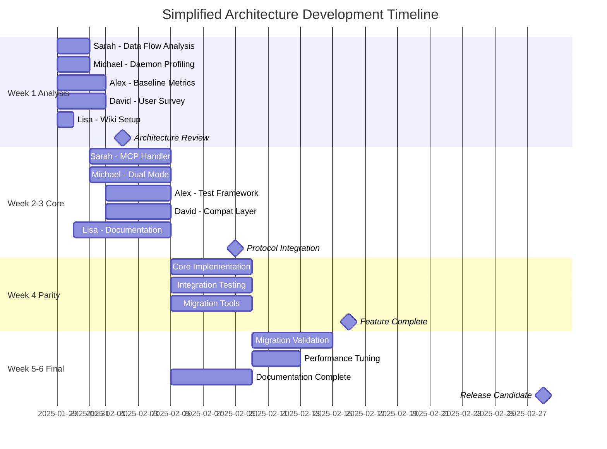

# Simplified Architecture - Task Dependency Flow

## Critical Path Visualization



## Task Dependency Matrix

### Week 1 Dependencies
```
┌─────────────┬────────┬─────────┬───────┬────────┬───────┐
│   From\To   │ Sarah  │ Michael │ Alex  │ David  │ Lisa  │
├─────────────┼────────┼─────────┼───────┼────────┼───────┤
│ Sarah (S1)  │   -    │    ○    │   ●   │   ●    │   ●   │
│ Michael (M1)│   ○    │    -    │   ●   │   ○    │   ●   │
│ Alex (A1)   │   ○    │    ○    │   -   │   ○    │   ●   │
│ David (D1)  │   ●    │    ○    │   ○   │   -    │   ●   │
│ Lisa (L1)   │   ○    │    ○    │   ○   │   ○    │   -   │
└─────────────┴────────┴─────────┴───────┴────────┴───────┘

● = Strong dependency (blocking)
○ = Weak dependency (informational)
```

### Critical Path Items (Must Complete On Time)

```
Week 1: Sarah's Architecture Analysis
   ↓
Week 2: Sarah's MCP Handler Design  
   ↓
Week 3: Michael's Socket Integration
   ↓
Week 4: Core Feature Implementation
   ↓
Week 5: Migration Tools Testing
   ↓
Week 6: Final Integration
```

## Parallel Work Streams

### Stream 1: Core Protocol (Sarah + Michael)
```
[Week 1] Analysis → [Week 2-3] Implementation → [Week 4] Integration
   │                     │                           │
   └── Provides ────────→└──── Provides ────────────→└── Feature Complete
         specs                working daemon              MCP-native daemon
```

### Stream 2: Quality Assurance (Alex)
```
[Week 1] Baseline → [Week 2] Framework → [Week 3-4] Testing → [Week 5-6] Validation
   │                    │                      │                    │
   └── Enables ────────→└──── Enables ────────→└──── Ensures ─────→└── 95% Coverage
       targets              automation            quality              confidence
```

### Stream 3: Migration Path (David)
```
[Week 1] Impact → [Week 2] Design → [Week 3-4] Build → [Week 5] Deploy
   │                  │                   │                 │
   └── Informs ──────→└──── Guides ─────→└──── Provides ──→└── Zero Downtime
       planning           compatibility       tools            migration
```

### Stream 4: Documentation (Lisa)
```
[Week 1] Structure → [Week 2-6] Continuous Documentation → [Week 6] Polish
   │                           │                               │
   └── Establishes ───────────→└────── Maintains ────────────→└── Ship-ready
       standards                      knowledge                    docs
```

## Handoff Choreography

### Week 1 → Week 2 Handoffs
```yaml
Monday Week 2:
  09:00: Sarah shares MCP mapping → Michael adapts daemon design
  10:00: Michael shares profiling → Alex creates performance tests  
  11:00: David shares user concerns → Sarah adjusts protocol design
  14:00: Alex shares test plan → All agents align on testing strategy
  15:00: Lisa publishes Week 1 summary → Team reviews progress
```

### Daily Micro-Handoffs
```yaml
Every Day at 17:00:
  - Code commits pushed to feature branches
  - Handoff documents updated in /shared/
  - Blockers posted to #simplified-arch channel
  - Next-day dependencies confirmed
```

## Risk-Based Task Ordering

### High-Risk First (Week 1-2)
1. **MCP Protocol Compatibility** - Sarah leads
2. **Performance Regression** - Michael + Alex validate
3. **Breaking Changes** - David documents exhaustively

### Medium-Risk (Week 3-4)  
1. **Feature Parity Gaps** - Full team effort
2. **Migration Complexity** - David + support
3. **Integration Issues** - Alex catches early

### Low-Risk (Week 5-6)
1. **Documentation Gaps** - Lisa has full context
2. **Deployment Issues** - Well-tested by then
3. **Final Optimizations** - Time buffer exists

## Optimization Opportunities

### Parallel Acceleration Points
- **Week 2**: While Sarah codes MCP handler, Michael can fully implement dual-mode
- **Week 3**: Alex can test completed components while others continue development
- **Week 4**: David can begin user migration testing with beta builds
- **Week 5**: Lisa can film tutorials while others polish

### Buffer Utilization
- **Sarah**: 2-day buffer for protocol issues
- **Michael**: 3-day buffer for performance tuning  
- **Alex**: Continuous testing provides early warning
- **David**: 1-week buffer for migration tools
- **Lisa**: Documentation can flex to fill gaps

## Success Indicators by Week

### Week 1 Success Signals
✓ All baseline measurements complete
✓ Architecture design approved by team
✓ No major technical blockers identified
✓ All agents successfully collaborating

### Week 2-3 Success Signals  
✓ MCP handler compiling and basic tests pass
✓ Dual-mode daemon switching correctly
✓ Test coverage tracking operational
✓ Migration approach validated with users

### Week 4 Success Signals
✓ All MCP methods implemented
✓ Performance within 20% of target  
✓ Migration tools working in test env
✓ Documentation 70% complete

### Week 5-6 Success Signals
✓ All tests green
✓ Performance targets exceeded
✓ Successful production pilot
✓ Documentation 100% complete

---

**Critical Success Factor**: Daily 17:00 handoffs must happen without fail
**Biggest Risk**: Week 2 MCP handler implementation blocking everything
**Mitigation**: Sarah + Michael pair on critical sections if needed