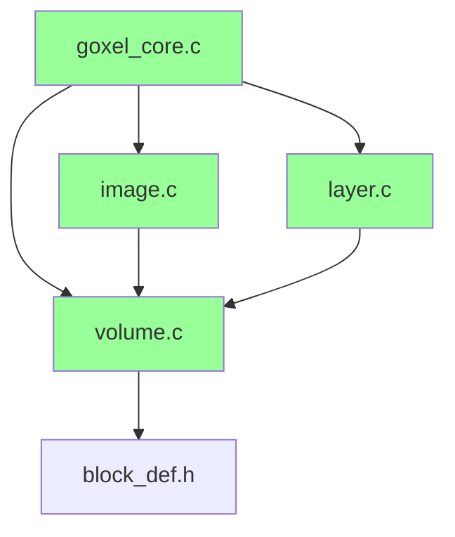
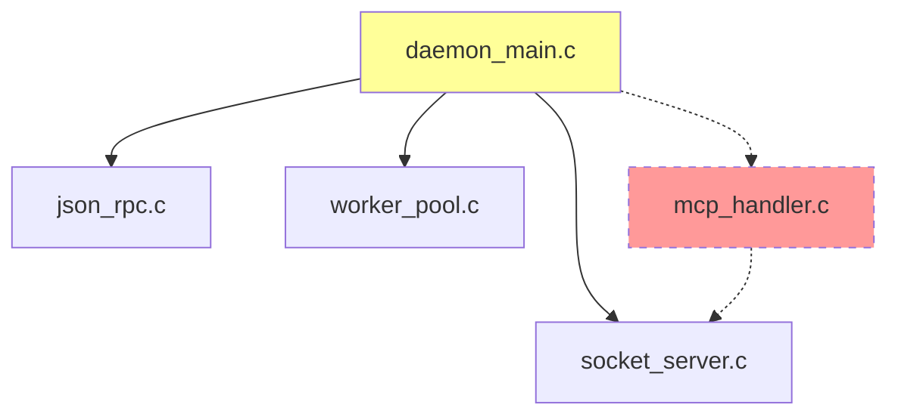
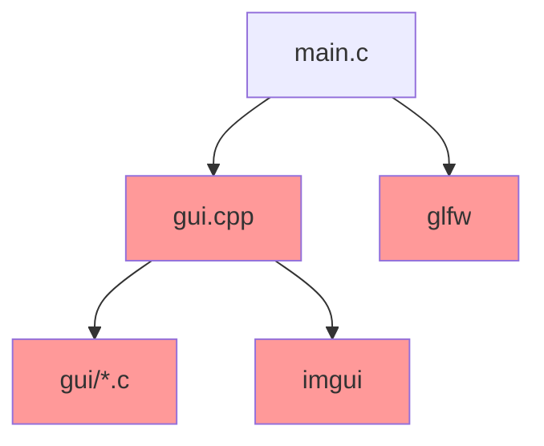
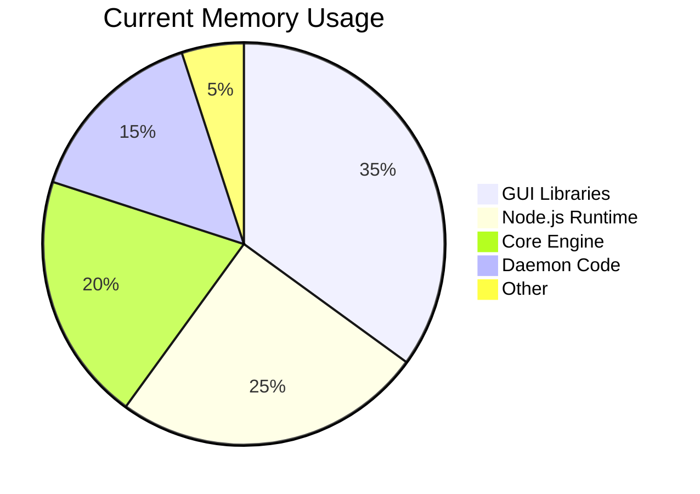
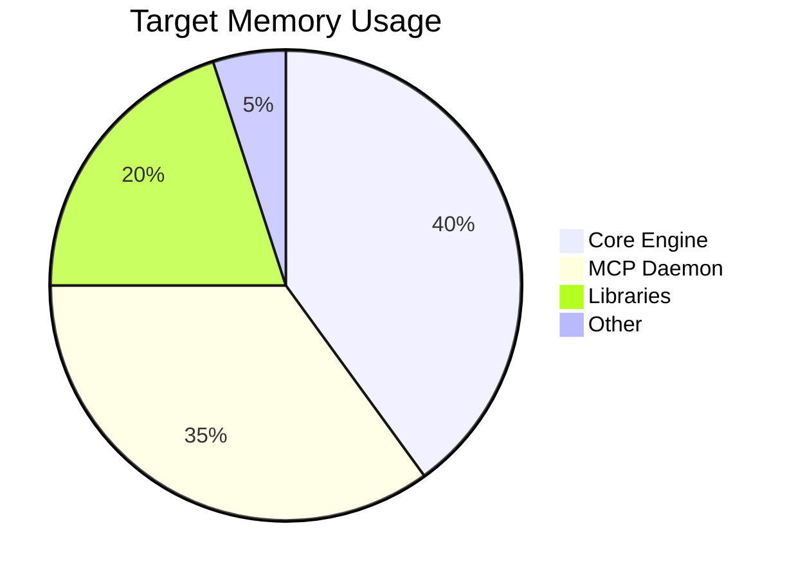

# Dependency Analysis Report

## Overview

This document provides a comprehensive analysis of all dependencies in the Goxel project, identifying which components are essential for the simplified architecture and which can be removed.

## External Dependencies

### Core Graphics & Rendering

| Library | Version | Purpose | Keep/Remove | Rationale |
|---------|---------|---------|-------------|-----------|
| **OpenGL** | 3.3+ | 3D rendering | ✅ Keep | Core rendering |
| **GLFW3** | 3.3+ | Window management | ❌ Remove | GUI only |
| **GLEW** | 2.1+ | GL extensions | ❌ Remove | GUI only |
| **OSMesa** | 11.2+ | Software rendering | ✅ Keep | Headless rendering |

### Data Processing

| Library | Version | Purpose | Keep/Remove | Rationale |
|---------|---------|---------|-------------|-----------|
| **stb_image** | 2.28 | Image I/O | ✅ Keep | Import/export |
| **stb_image_write** | 1.16 | Image writing | ✅ Keep | Export functionality |
| **xxhash** | 0.8.1 | Fast hashing | ✅ Keep | Volume operations |
| **uthash** | 2.3.0 | Hash tables | ✅ Keep | Core data structures |

### File Formats

| Library | Version | Purpose | Keep/Remove | Rationale |
|---------|---------|---------|-------------|-----------|
| **cgltf** | 1.13 | glTF support | ✅ Keep | Export format |
| **tinyobjloader** | 2.0 | OBJ loading | ✅ Keep | Import format |
| **voxelizer** | Custom | Mesh→voxel | ✅ Keep | Import feature |

### UI & Interaction

| Library | Version | Purpose | Keep/Remove | Rationale |
|---------|---------|---------|-------------|-----------|
| **Dear ImGui** | 1.89 | GUI framework | ❌ Remove | GUI only |
| **ImGuizmo** | 1.83 | 3D gizmos | ❌ Remove | GUI only |
| **nfd** | 1.1.6 | File dialogs | ❌ Remove | GUI only |

### Optimization & Utils

| Library | Version | Purpose | Keep/Remove | Rationale |
|---------|---------|---------|-------------|-----------|
| **meshoptimizer** | 0.18 | Mesh optimization | ✅ Keep | Export optimization |
| **yocto** | Custom | Graphics utils | ⚠️ Partial | Keep BVH only |
| **quickjs** | 2021-03 | JS scripting | ⚠️ Optional | Feature decision |

### MCP Integration (New)

| Library | Version | Purpose | Keep/Remove | Rationale |
|---------|---------|---------|-------------|-----------|
| **json-parser** | 1.1.0 | JSON parsing | ✅ Keep | Already in use |
| **libuv** | 1.44.2 | Event loop | 🆕 Add | MCP async I/O |

## Internal Dependencies

### Core Modules (Keep)



### Daemon Modules (Modify)



### GUI Modules (Remove)



## Dependency Tree Simplification

### Current State (v14.0)
```
Total Dependencies: 28
External Libraries: 18
Internal Modules: 45+
Binary Size: ~8MB
```

### Target State (Simplified)
```
Total Dependencies: 15
External Libraries: 10
Internal Modules: 25
Binary Size: ~4MB (50% reduction)
```

## Migration Impact

### Libraries to Remove

1. **GUI Framework Stack**
   - Dear ImGui (all files)
   - ImGuizmo
   - GLFW3
   - GLEW
   - Native file dialogs

2. **Node.js Dependencies**
   - All npm packages
   - TypeScript runtime
   - HTTP libraries

### Libraries to Add

1. **MCP Support**
   - libuv for async I/O
   - Protocol buffer library (optional)

### Modified Components

```c
// Before: Multiple entry points
main.c → GUI application
daemon_main.c → JSON-RPC daemon
mcp-server/index.js → MCP server

// After: Single entry point
mcp_daemon_main.c → Unified MCP daemon
```

## Build System Changes

### SCons Configuration

```python
# Remove GUI-related flags
if not headless:
    env.ParseConfig('pkg-config --cflags --libs glfw3')
    env.ParseConfig('pkg-config --cflags --libs gtk+-3.0')

# Add MCP dependencies
if mcp_mode:
    env.ParseConfig('pkg-config --cflags --libs libuv')
    env.Append(CPPDEFINES=['GOXEL_MCP_MODE'])
```

### Compilation Flags

```makefile
# Before
CFLAGS += -DGOXEL_GUI -DIMGUI_IMPL_OPENGL_LOADER_GLEW

# After  
CFLAGS += -DGOXEL_MCP_DAEMON -DNO_GUI
```

## Memory Footprint Analysis





## Recommendations

### Phase 1: Analysis
1. Create dependency graph tool
2. Measure actual usage of each library
3. Identify cross-dependencies

### Phase 2: Preparation
1. Abstract GUI-specific code
2. Create headless alternatives
3. Test without GUI libraries

### Phase 3: Implementation
1. Remove GUI dependencies
2. Integrate MCP directly
3. Optimize build configuration

### Phase 4: Validation
1. Verify all features work
2. Benchmark performance
3. Measure resource usage

---

**Next**: [Build System Modifications](BUILD_SYSTEM_CHANGES.md) →

**Last Updated**: January 29, 2025  
**Version**: 1.0.0  
**Author**: Lisa Thompson