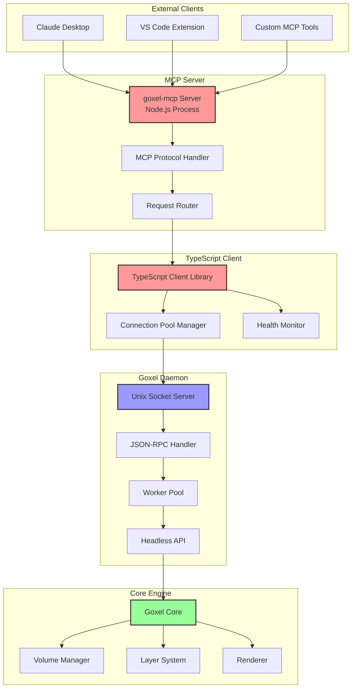
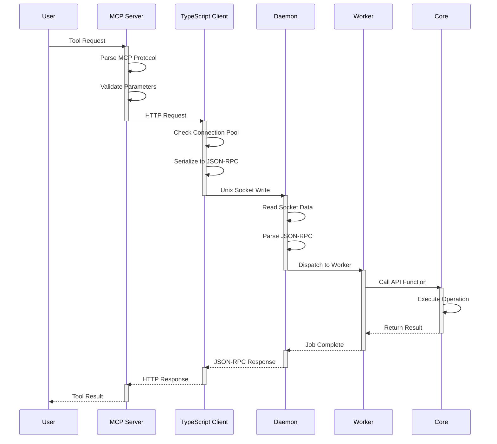
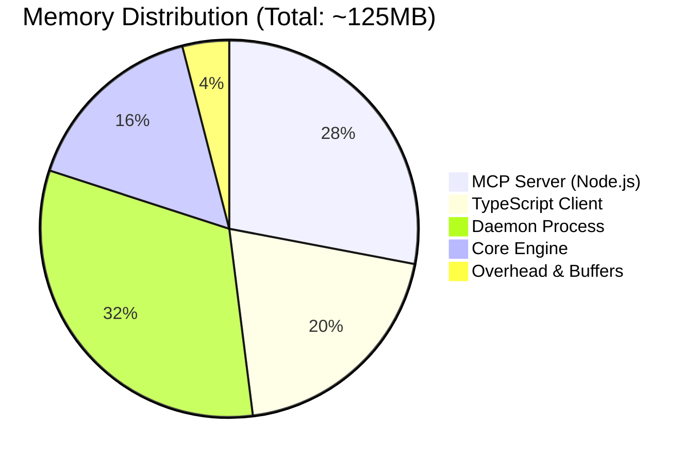
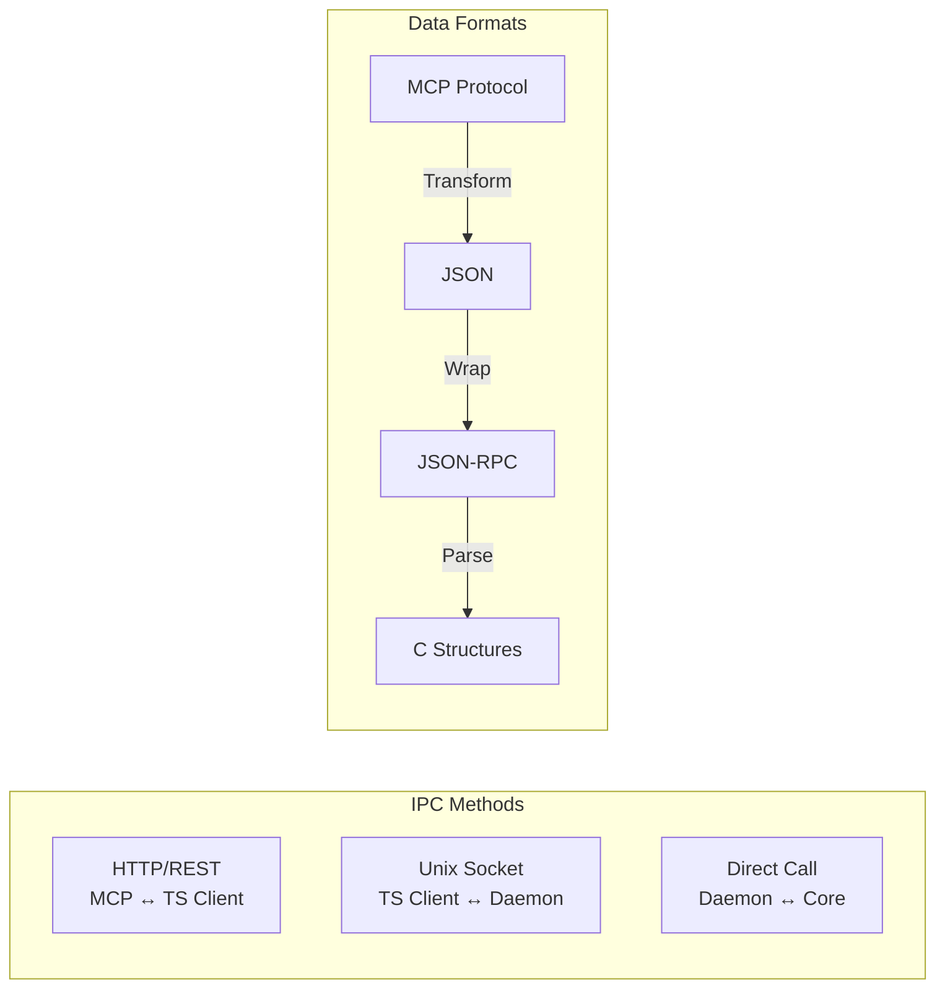
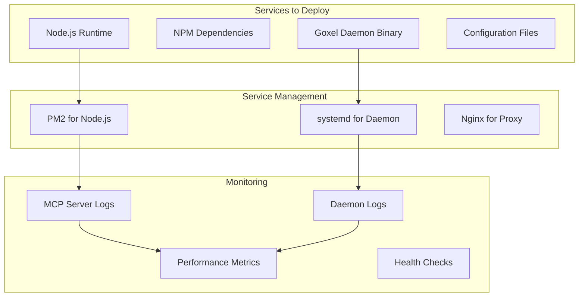

# Current Architecture Diagrams

## System Overview

## Detailed Component Interactions

```mermaid
flowchart LR
    subgraph "Layer 1: MCP Interface"
        MCP_IN[MCP Request] --> PARSE1[Protocol Parser]
        PARSE1 --> VALIDATE1[Validation]
        VALIDATE1 --> TRANSFORM1[Transform to HTTP]
    end
    
    subgraph "Layer 2: TypeScript Client"
        HTTP_IN[HTTP Request] --> QUEUE[Request Queue]
        QUEUE --> SERIALIZE1[Serialize to JSON-RPC]
        SERIALIZE1 --> SOCKET[Socket Selection]
    end
    
    subgraph "Layer 3: JSON-RPC Daemon"
        UNIX_IN[Unix Socket] --> PARSE2[JSON Parser]
        PARSE2 --> VALIDATE2[Method Validation]
        VALIDATE2 --> DISPATCH[Worker Dispatch]
    end
    
    subgraph "Layer 4: Core Engine"
        API_CALL[API Function] --> EXEC[Execute Operation]
        EXEC --> RESULT[Generate Result]
    end
    
    TRANSFORM1 --> HTTP_IN
    SOCKET --> UNIX_IN
    DISPATCH --> API_CALL
```

## Request Flow Sequence

## Performance Bottlenecks

```mermaid
graph TD
    subgraph "Serialization Overhead"
        S1[MCP to JSON] --> S2[JSON to HTTP]
        S2 --> S3[HTTP to JSON-RPC]
        S3 --> S4[JSON-RPC to C Structs]
    end
    
    subgraph "Network Hops"
        N1[Client to MCP Server] --> N2[MCP to TypeScript]
        N2 --> N3[TypeScript to Daemon]
    end
    
    subgraph "Processing Delays"
        P1[MCP Validation] --> P2[TypeScript Queue]
        P2 --> P3[Worker Pool Wait]
        P3 --> P4[Response Assembly]
    end
    
    S1 -.-> |~1ms| S2
    S2 -.-> |~0.5ms| S3
    S3 -.-> |~1ms| S4
    
    N1 -.-> |~2ms| N2
    N2 -.-> |~1ms| N3
    
    P1 -.-> |~0.5ms| P2
    P2 -.-> |~1ms| P3
    P3 -.-> |~0.5ms| P4
```

## Memory Usage Profile

## Process Communication

## Deployment Complexity

---

**Analysis**: The current architecture introduces significant complexity through multiple layers, each adding latency and resource overhead. The 4-layer approach was designed for modularity but results in:

- **4 serialization steps** per request
- **3 network hops** (even on localhost)
- **~125MB memory overhead**
- **5-10ms total latency**
- **Complex deployment** requiring multiple services

**Next**: [Target Architecture Diagrams](TARGET_ARCHITECTURE.md) →

**Last Updated**: January 29, 2025  
**Version**: 1.0.0  
**Author**: Lisa Thompson