# Target Architecture Diagrams

## Simplified System Overview

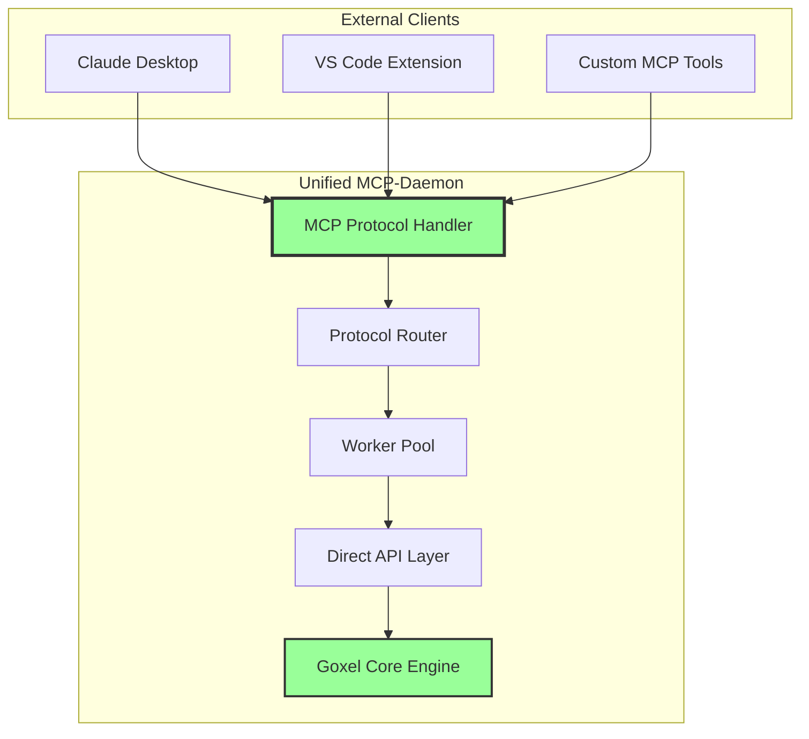

## Direct Request Flow

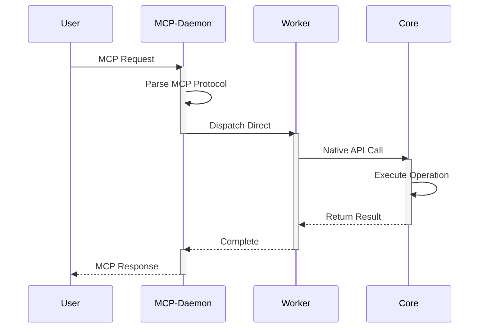

## Performance Improvements

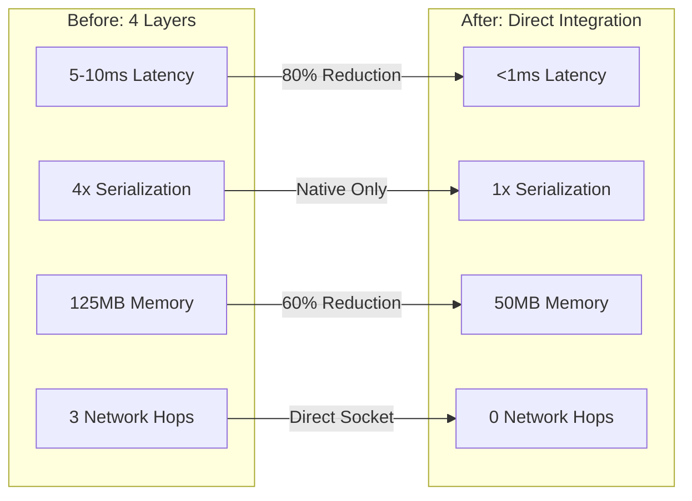

## Unified Process Architecture

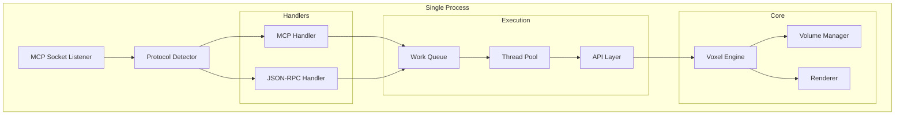

## Memory Efficiency

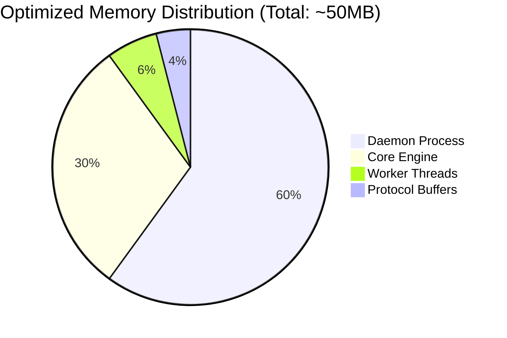

## Dual-Mode Operation (Transition)

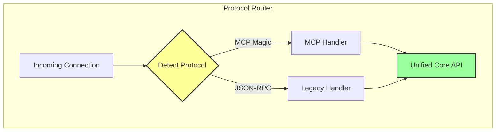

## Zero-Copy Data Flow

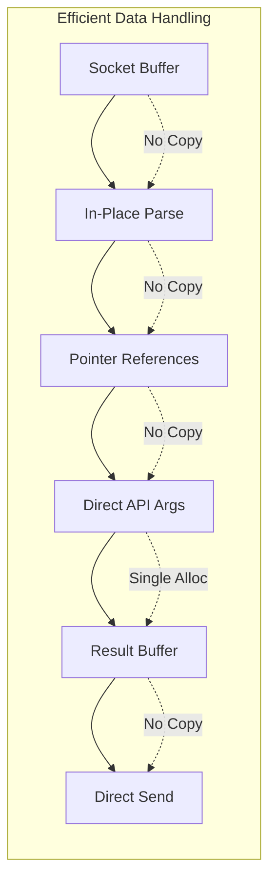

## Deployment Simplicity

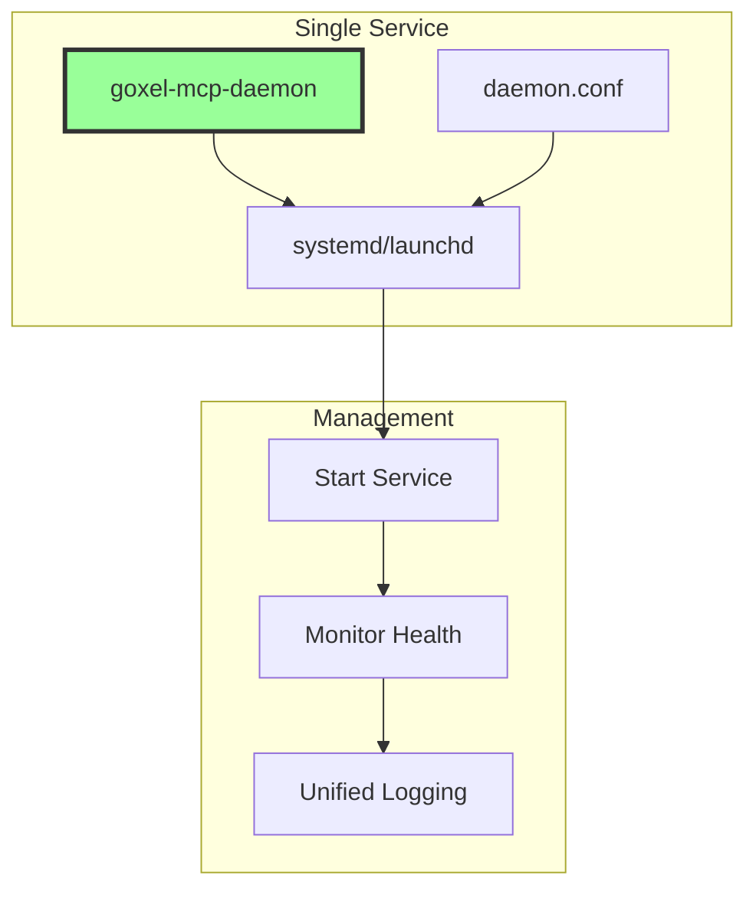

## Performance Characteristics

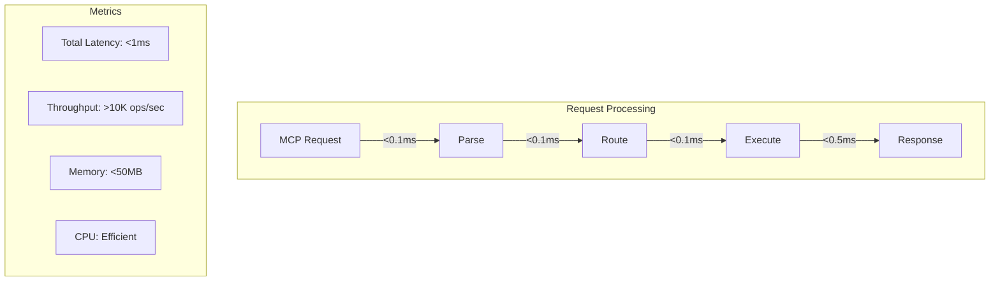

## Migration Path

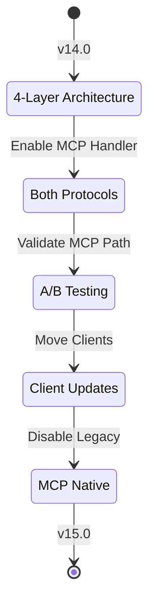

## Monitoring Dashboard

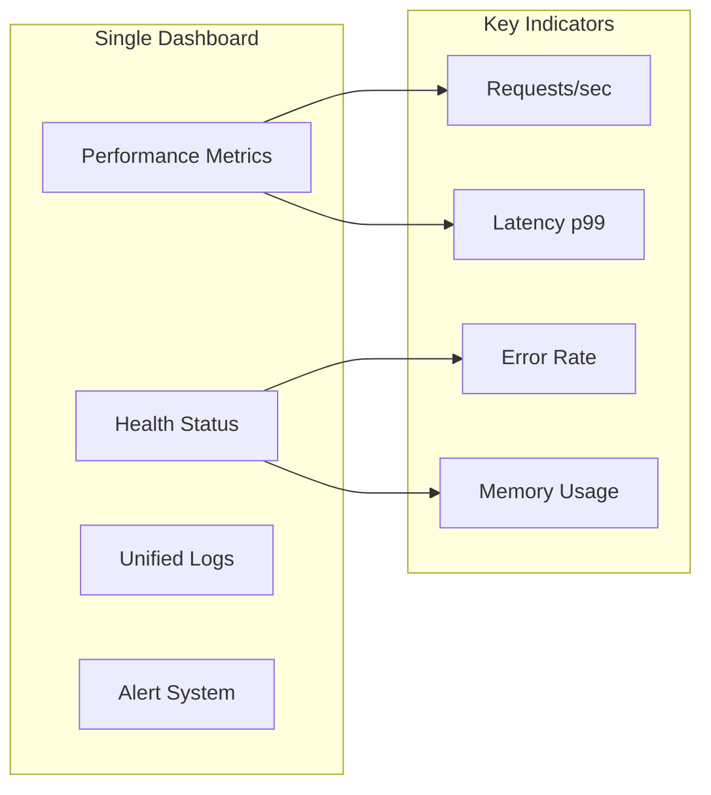

---

**Benefits Summary**:

1. **Performance**: 80% latency reduction, 60% memory savings
2. **Simplicity**: Single process, unified logging, one service
3. **Efficiency**: Zero-copy paths, direct API calls
4. **Flexibility**: Dual-mode support during transition
5. **Operations**: Simplified deployment and monitoring

**Next**: [Implementation Roadmap](../wiki/03_IMPLEMENTATION_GUIDE.md) →

**Last Updated**: January 29, 2025  
**Version**: 1.0.0  
**Author**: Lisa Thompson