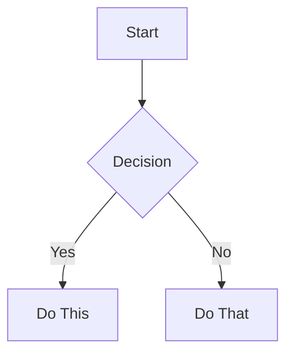
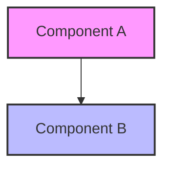

# Documentation Standards Guide

## Overview

This guide establishes the documentation standards for the Goxel Simplified Architecture project. Consistent documentation helps team members quickly understand and contribute to the project.

## Document Structure

### 1. **File Naming Convention**
```
XX_DOCUMENT_NAME.md
```
- Use two-digit prefix for ordering (00-99)
- Use UPPERCASE with underscores for primary docs
- Use lowercase with hyphens for subdocuments

Examples:
- `01_ARCHITECTURE_OVERVIEW.md` (main document)
- `api-method-reference.md` (subdocument)

### 2. **Document Header Template**
```markdown
# Document Title

## Overview
Brief description of what this document covers.

## Table of Contents
- [Section 1](#section-1)
- [Section 2](#section-2)
- [Section 3](#section-3)

## Prerequisites
What readers should know before reading this document.
```

### 3. **Metadata Footer**
```markdown
---

**Next**: [Next Document](link) →  
**Previous**: ← [Previous Document](link)

**Last Updated**: YYYY-MM-DD  
**Version**: X.Y.Z  
**Author**: Name
```

## Markdown Guidelines

### 1. **Headings**
- Use `#` for document title
- Use `##` for major sections
- Use `###` for subsections
- Use `####` for minor points
- Don't skip heading levels

### 2. **Code Blocks**
Always specify the language:
```c
// C code example
int daemon_start(const char *socket_path) {
    return 0;
}
```

```bash
# Shell commands
./goxel-daemon --protocol=mcp
```

### 3. **Tables**
Use tables for structured data:
| Column 1 | Column 2 | Column 3 |
|----------|----------|----------|
| Data 1   | Data 2   | Data 3   |

## Diagram Standards

### 1. **Mermaid Diagrams**
Use Mermaid for all diagrams:



### 2. **Diagram Types**
- **Architecture**: Use `graph` or `flowchart`
- **Sequences**: Use `sequenceDiagram`
- **State**: Use `stateDiagram-v2`
- **Class**: Use `classDiagram`

### 3. **Styling Guidelines**


## Writing Style

### 1. **Voice and Tone**
- Use active voice
- Be concise and clear
- Avoid jargon without explanation
- Write for developers

### 2. **Technical Accuracy**
- Verify all code examples compile
- Test all commands
- Include version numbers
- Specify platform differences

### 3. **Examples**
Good:
> "The daemon starts listening on the Unix socket at `/tmp/goxel.sock`"

Avoid:
> "It begins doing its thing with the file"

## Code Documentation

### 1. **Inline Comments**
```c
// Calculate voxel density for the given volume
// Returns: density value between 0.0 and 1.0
float calculate_density(volume_t *vol) {
    // Implementation
}
```

### 2. **Function Documentation**
```c
/**
 * Initialize the MCP protocol handler
 * 
 * @param config Configuration structure
 * @param socket_path Path to Unix socket
 * @return 0 on success, negative error code on failure
 * 
 * Example:
 *   mcp_config_t config = {.version = "1.0"};
 *   int result = mcp_init(&config, "/tmp/goxel.sock");
 */
int mcp_init(mcp_config_t *config, const char *socket_path);
```

## Visual Elements

### 1. **Status Indicators**
- ✅ Complete
- 🟡 In Progress
- ❌ Blocked
- ⬜ Not Started

### 2. **Priority Markers**
- 🔴 P0 - Critical
- 🟠 P1 - High
- 🟡 P2 - Medium
- 🟢 P3 - Low

### 3. **Callout Boxes**
> **Note**: Important information

> **Warning**: Caution required

> **Tip**: Helpful suggestion

## Version Control

### 1. **Document Versioning**
- Use semantic versioning (X.Y.Z)
- Major: Significant restructure
- Minor: New sections added
- Patch: Corrections and clarifications

### 2. **Change Log**
Maintain a changelog at the bottom:
```markdown
## Changelog

### Version 1.1.0 (2025-01-29)
- Added MCP protocol section
- Updated examples

### Version 1.0.0 (2025-01-29)
- Initial documentation
```

## Templates

### 1. **API Method Template**
```markdown
### method_name

**Description**: Brief description

**Request**:
```json
{
    "method": "method_name",
    "params": {
        "param1": "value1"
    }
}
```

**Response**:
```json
{
    "result": {
        "field1": "value1"
    }
}
```

**Errors**:
- `ERROR_CODE`: Description
```

### 2. **How-To Template**
```markdown
# How to [Task Name]

## Prerequisites
- Requirement 1
- Requirement 2

## Steps

### 1. First Step
Description and commands

### 2. Second Step
Description and commands

## Verification
How to verify success

## Troubleshooting
Common issues and solutions
```

## Review Process

### 1. **Self-Review Checklist**
- [ ] Spell check completed
- [ ] Code examples tested
- [ ] Links verified
- [ ] Diagrams render correctly
- [ ] Formatting consistent

### 2. **Peer Review**
- Technical accuracy
- Clarity and completeness
- Adherence to standards
- Example quality

## Tools and Resources

### 1. **Recommended Tools**
- **Editor**: VSCode with Markdown Preview
- **Diagrams**: Mermaid Live Editor
- **Spell Check**: cspell
- **Link Check**: markdown-link-check

### 2. **Useful Extensions**
- Markdown All in One
- Mermaid Preview
- Markdown Lint

---

**Last Updated**: January 29, 2025  
**Version**: 1.0.0  
**Author**: Lisa Thompson