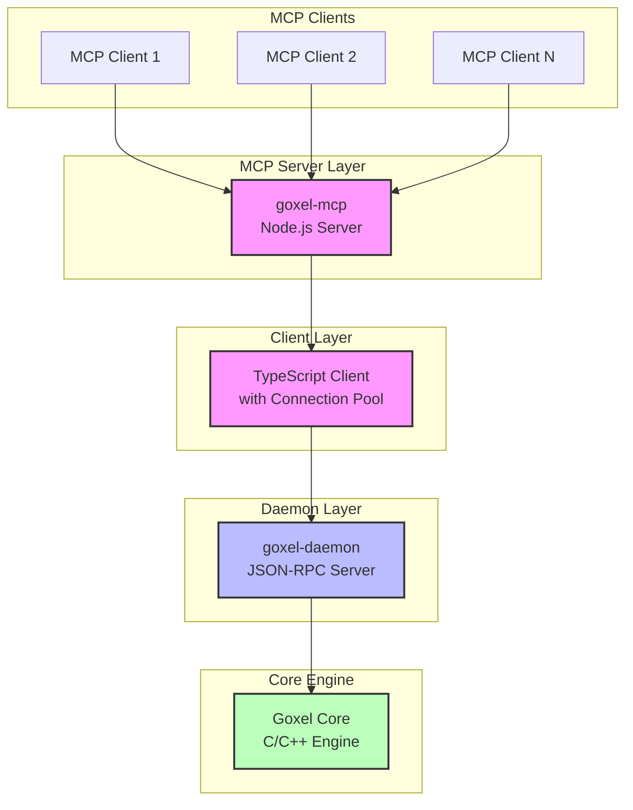
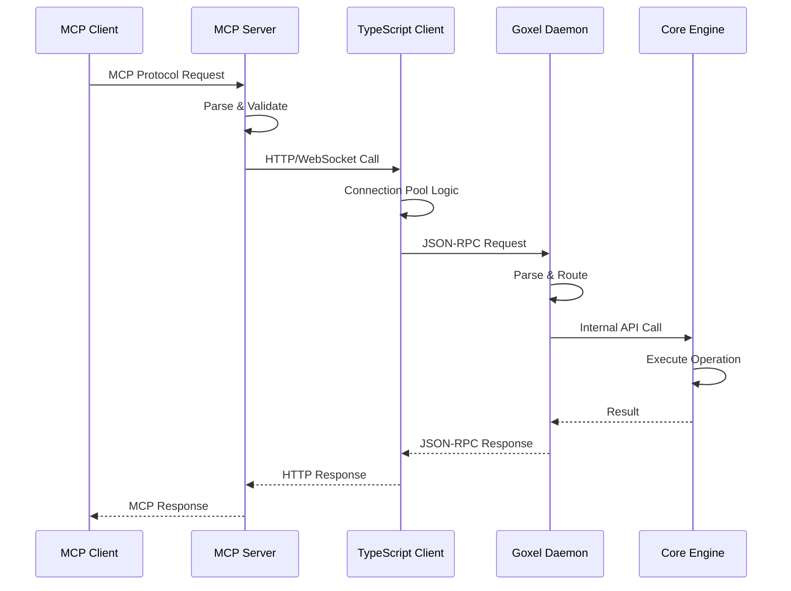
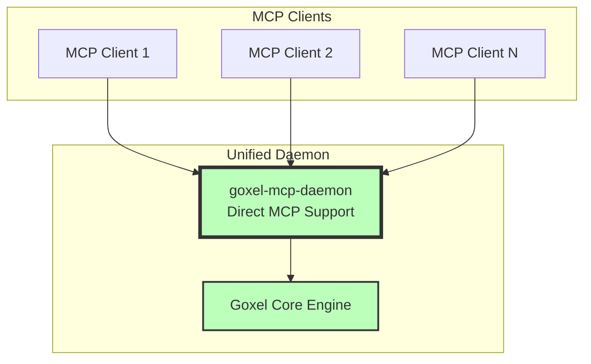
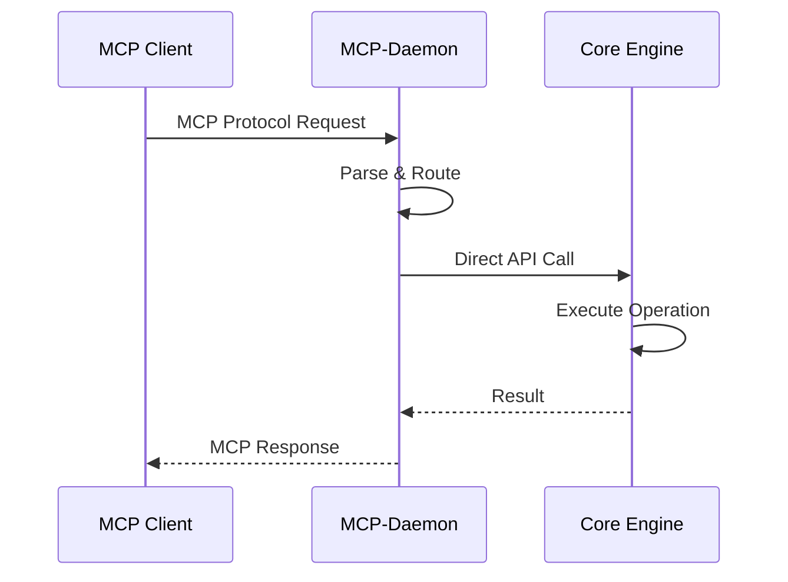
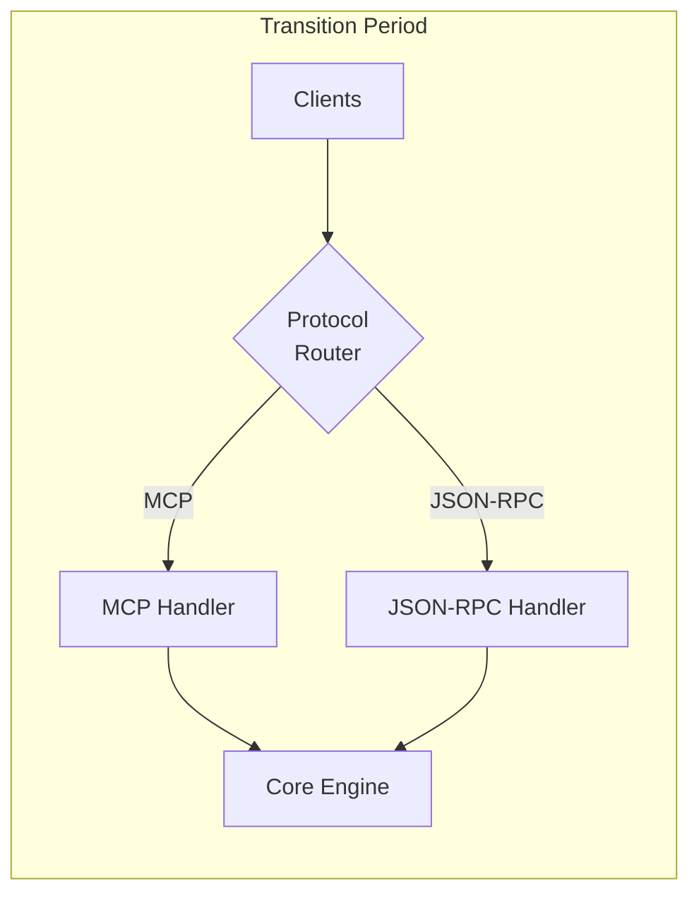
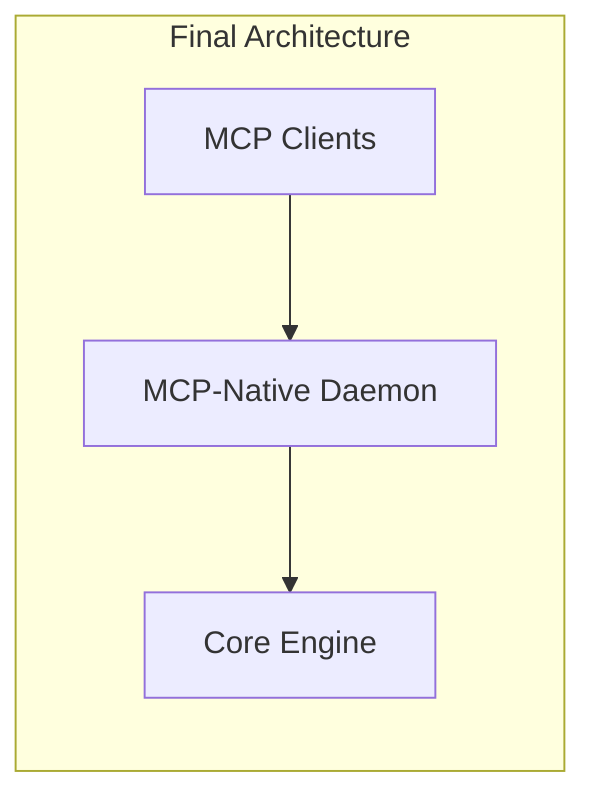

# Architecture Overview

## Current Architecture (v14.0)

The current Goxel architecture consists of multiple layers that introduce unnecessary complexity and performance overhead.

### Component Stack

### Current Data Flow

### Performance Impact

| Metric | Current Value | Overhead Source |
|--------|--------------|-----------------|
| Latency | ~5-10ms | 4 network hops |
| Serialization | 4x | Multiple format conversions |
| Memory | ~125MB | Duplicate data structures |
| CPU | +40% | Protocol translations |

## Target Architecture (Simplified)

The simplified architecture eliminates intermediate layers, providing direct MCP protocol support in the daemon.

### Simplified Component Stack

### Optimized Data Flow

### Expected Performance Improvements

| Metric | Target Value | Improvement |
|--------|--------------|-------------|
| Latency | <1ms | 80% reduction |
| Serialization | 1x | Native format only |
| Memory | ~50MB | 60% reduction |
| CPU | Baseline | 40% reduction |

## Architectural Benefits

### 1. **Reduced Complexity**
- Single daemon process instead of 3 services
- Direct protocol handling
- Simplified deployment

### 2. **Performance Gains**
- Eliminate intermediate network hops
- Remove redundant serialization
- Direct memory access

### 3. **Operational Simplicity**
- Single service to monitor
- Unified logging
- Simplified debugging

### 4. **Resource Efficiency**
- Lower memory footprint
- Reduced CPU usage
- Fewer network connections

## Migration Strategy

### Phase 1: Dual-Mode Support

### Phase 2: MCP-Native

## Technical Considerations

### 1. **Protocol Handling**
- Native MCP parser in C
- Zero-copy message processing
- Efficient buffer management

### 2. **Backward Compatibility**
- Dual-mode operation during transition
- Compatibility shim for legacy clients
- Graceful deprecation path

### 3. **Performance Optimization**
- Lock-free data structures
- Memory pool allocation
- CPU affinity for workers

### 4. **Monitoring & Debugging**
- Built-in performance metrics
- Protocol-level debugging
- Trace logging capabilities

---

**Next**: [Dependencies Documentation](02_DEPENDENCIES.md) →

**Last Updated**: January 29, 2025  
**Version**: 1.0.0  
**Author**: Lisa Thompson