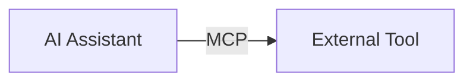
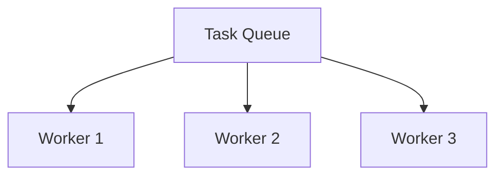
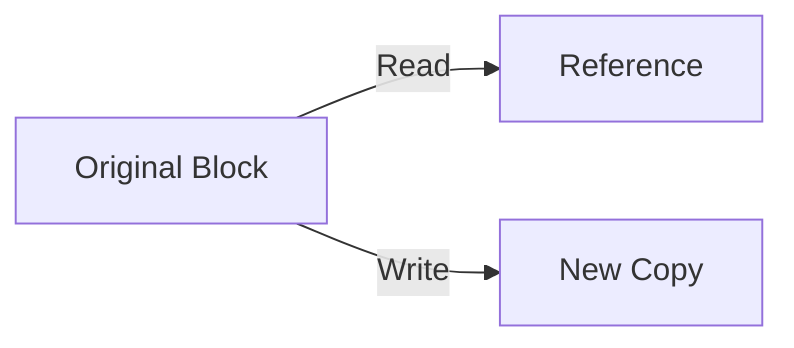

# Goxel Technical Glossary

## Architecture Terms

### **MCP (Model Context Protocol)**
A protocol developed by Anthropic for AI tool integration. Enables AI assistants to interact with external tools and services through a standardized interface.



### **JSON-RPC**
A remote procedure call protocol encoded in JSON. Used for client-server communication in the current Goxel daemon.

```json
{
    "jsonrpc": "2.0",
    "method": "create_voxel",
    "params": {"x": 0, "y": 0, "z": 0},
    "id": 1
}
```

### **Daemon**
A background process that handles requests without a user interface. The Goxel daemon processes voxel operations.

### **Worker Pool**
A collection of threads that process tasks concurrently. Improves performance by handling multiple operations simultaneously.



## Voxel Engine Terms

### **Voxel**
A 3D pixel - the fundamental unit in Goxel. Each voxel has position (x,y,z) and color (RGBA).

### **Volume**
A 3D space containing voxels. Implemented using sparse data structures for efficiency.

### **Block**
A 16³ chunk of voxels. The basic unit of storage in Goxel's engine.

```
Block = 16 x 16 x 16 voxels = 4,096 voxels
```

### **Layer**
A volume with additional properties like visibility, opacity, and blend mode. Projects can have multiple layers.

### **Image**
In Goxel context, a collection of layers representing the complete 3D scene.

## Technical Terms

### **Copy-on-Write (CoW)**
An optimization where data is only copied when modified. Saves memory by sharing unchanged data.



### **Sparse Data Structure**
A structure that efficiently stores data with many empty values. Goxel uses this for volumes with empty space.

### **Headless Rendering**
Rendering without a display, using OSMesa for software rendering. Essential for server deployments.

### **Socket (Unix Domain Socket)**
A communication endpoint for exchanging data between processes on the same host. More efficient than network sockets.

```
/tmp/goxel.sock
```

## Protocol Terms

### **Serialization**
Converting data structures to a format suitable for transmission or storage.

```
C Struct → JSON → Network → JSON → C Struct
```

### **Protocol Router**
Component that examines incoming requests and directs them to appropriate handlers based on protocol type.

### **Zero-Copy**
Data processing technique that avoids unnecessary copying of data in memory, improving performance.

## Performance Terms

### **Latency**
Time delay between request and response. Current: 5-10ms, Target: <1ms.

### **Throughput**
Number of operations processed per unit time. Target: >10,000 ops/sec.

### **Memory Footprint**
Total memory used by the application. Current: ~125MB, Target: ~50MB.

## File Format Terms

### **glTF**
GL Transmission Format - a standard for 3D model distribution.

### **Magica Voxel (.vox)**
Popular voxel file format used by MagicaVoxel editor.

### **Wavefront (.obj)**
Common 3D file format for mesh data.

### **Qubicle (.qb/.qef)**
File formats used by Qubicle voxel editor.

## Build System Terms

### **SCons**
Python-based build tool used by Goxel. Alternative to Make.

### **Compilation Flags**
Options passed to the compiler to control build behavior.

```bash
-DGOXEL_MCP_MODE  # Enable MCP mode
-DNO_GUI          # Disable GUI components
```

## Deployment Terms

### **systemd**
Linux system and service manager. Used to run Goxel daemon as a service.

### **launchd**
macOS system service manager. Equivalent to systemd on macOS.

### **Connection Pool**
A cache of reusable connections to improve performance and resource usage.

## Abbreviations

| Abbreviation | Full Term |
|--------------|-----------|
| API | Application Programming Interface |
| BVH | Bounding Volume Hierarchy |
| CoW | Copy-on-Write |
| GUI | Graphical User Interface |
| I/O | Input/Output |
| IPC | Inter-Process Communication |
| MCP | Model Context Protocol |
| RPC | Remote Procedure Call |
| TCP | Transmission Control Protocol |
| UI | User Interface |
| UUID | Universally Unique Identifier |

---

**Last Updated**: January 29, 2025  
**Version**: 1.0.0  
**Maintainer**: Lisa Thompson